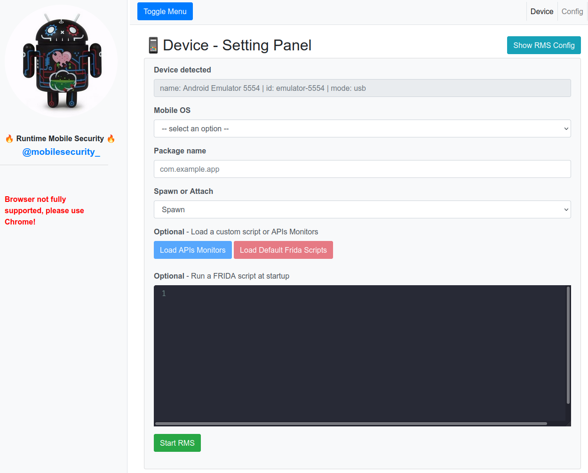
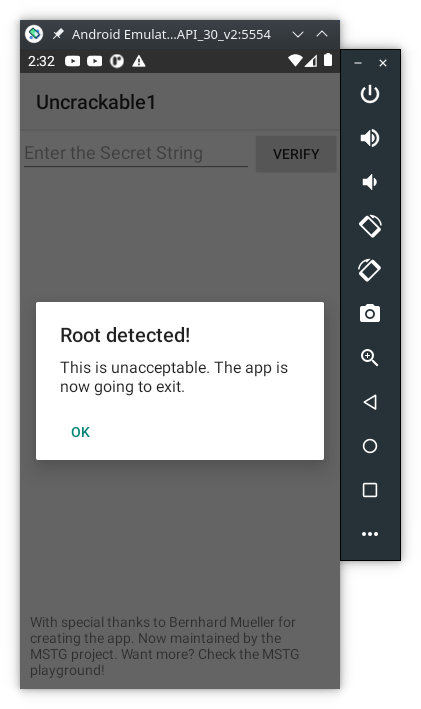
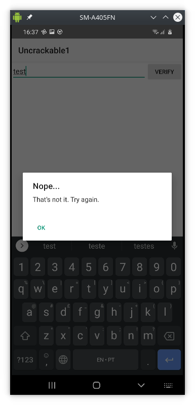
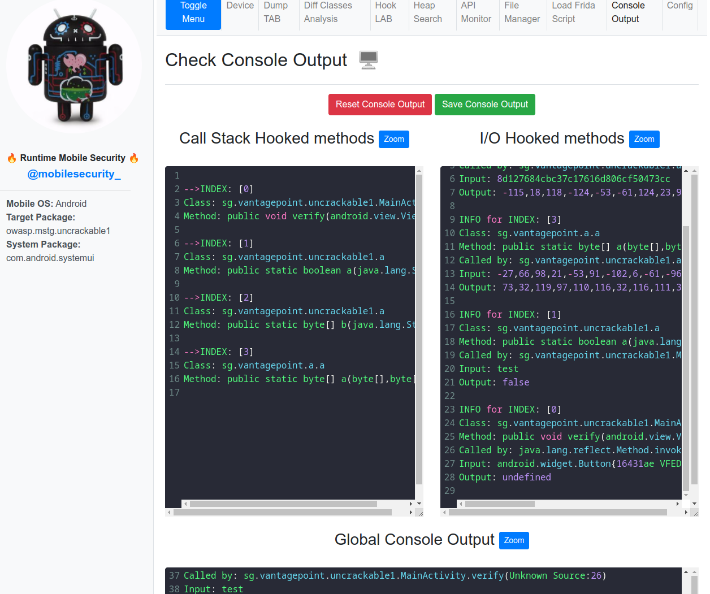
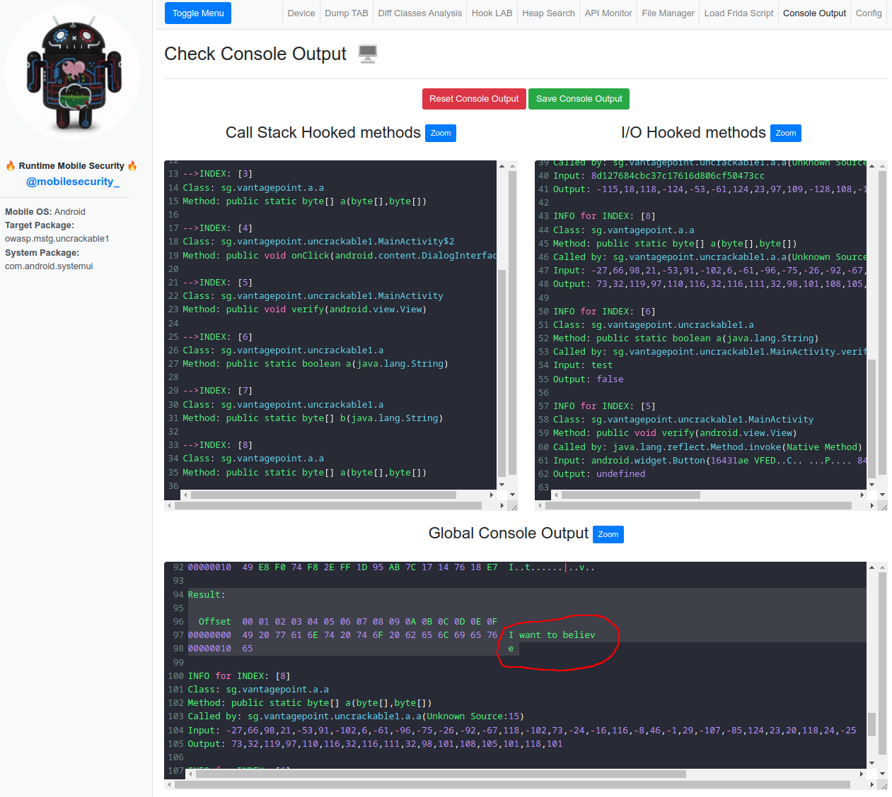
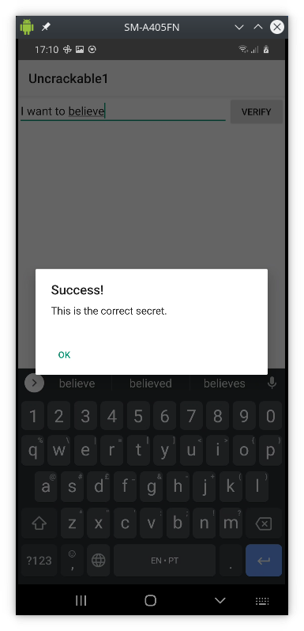

# Tutorial: Solving UnCrackable Android App Level 1 with RMS <!-- omit in toc -->
Solving c with Runtime Mobile Security (RMS), based on this [video](https://youtu.be/P6rNPkM2DdY)

| Version | 2022.04.08 |
| :-:     | :--        |
|  | This work is licensed under a [Creative Commons Attribution-NonCommercial-ShareAlike 4.0 International License](http://creativecommons.org/licenses/by-nc-sa/4.0/) |

## Table of Contents <!-- omit in toc -->

- [Requirements](#requirements)
- [Installation of Runtime Mobile Security (RMS)](#installation-of-runtime-mobile-security-rms)
- [Solving UnCrackable Android App Level 1](#solving-uncrackable-android-app-level-1)
  - [Bypass the root detection protection](#bypass-the-root-detection-protection)
  - [Discover the secret value inside the app](#discover-the-secret-value-inside-the-app)

> ***WARNING***
> 
> This tutorial is under construction!


## Requirements

1. NodeJS installed on your computer
    - [How To Install Node.js 14 on Ubuntu 22.04|20.04|18.04](https://computingforgeeks.com/install-node-js-14-on-ubuntu-debian-linux/)
    - [How to Install Node.js and NPM on Windows](https://phoenixnap.com/kb/install-node-js-npm-on-windows)
2. FRIDA tools (client and server)
    - as explained in the "Tutorial: Android Network Traffic Interception" and follow the [Bypass Certificate Pinning](https://labcif.github.io/Tutorial-AndroidNetworkInterception/#bypass-certificate-pinning) section

> ***NOTE***
>
> This tutorial might not work with an Android Virtual Device due to the limitations of the used tools.
> These instructions were tested on a Samsung A40 running Android 10.

## Installation of Runtime Mobile Security (RMS)

1. Open the terminal and run the following command to install the npm package:

```Console
> npm install -g rms-runtime-mobile-security
```

2. Make sure `frida-server` is up and running on the target device and make a quick test:

```Console
> frida-ps -Uai
 PID  Name                     Identifier                             
----  -----------------------  ---------------------------------------
2164  Calendar                 com.google.android.calendar            
1297  Google                   com.google.android.googlequicksearchbox
...
```

3. Launch RMS via the following command:

```Console
> rms
RMS - Runtime Mobile Security
Version: 1.5.11
by @mobilesecurity_
Twitter Profile: https://twitter.com/mobilesecurity_
_________________________________________________________

Running on http://127.0.0.1:5000/ (Press CTRL+C to quit)
```

4. Open your browser at `[http://127.0.0.1:5000/](http://127.0.0.1:5000/)` and this is how it looks:



On `Device detected` you should see your `Android Emulator`.

> ***NOTE***
>
> If RMS is not able to detect your device, please perform the following checks:
>
> - check if `frida-server` is up and running on the target device
> - `RMS` must be started after `frida-server`
> - make sure that only 1 device is connected to your computer, `RMS` is currently not able to detect multiple devices
> - kill `RMS` and start it again

## Solving UnCrackable Android App Level 1

There are two steps to solve this challenge:

1. bypass the root detection protection
2. discover the secret value inside the app

### Bypass the root detection protection

First, download the [UnCrackable-Level1.apk](https://github.com/OWASP/owasp-mstg/raw/master/Crackmes/Android/Level_01/UnCrackable-Level1.apk) app, then install it:

```Console
> adb install UnCrackable-Level1.apk 
Success
```

Now, run the `Uncrackable1` app and you should see this error message:



The app is able to detect that it's running on a rootedf device and exists. This is a common security mechanism used to prevent man-in-the-middle attacks. However, this is exactly want we want to do in order to study the app behaviour.

The next step is to **trick** the app to believe the device isn't rooted. This can be acheived with a `frida` script, but `RMS` already has some built-in scripts for thid purpose. The next steps are:

1. under `Mobile OS` choose `Android`
2. under `Package name` type `owasp.mstg.uncrackable1`
   - `frida-ps -Uai` will list all installed apps and their names
3. click `Load Default Frida Scripts` and choose `[24] system_exit_bypass.js` (the number might be different depending on the installed version)
4. click the button `Start RMS`
5. now go to the Android device, the app `Uncrackable1` should be open and show the same `Root detected` error
   - what happens now if you click `OK`?
   - the app should stay open inspite of the error message
6. type `test` in the `Enter the Secret String` field and click `VERIFY`



### Discover the secret value inside the app

On the `RMS` tool:

- click the botton `Load Classes`
- click the botton `Insert a Filter`
- insert in `Hook all classes that start with` field the text `sg.vantagepoint`
- then click `Submit`
- here's what you should have by now:
- then click the button `3. Load Methods` 
- followed by the `4. Hook all methods` button

On the Android device:

- hit the `VERIFY` button again

Here's what you should have now on `RMS`



Still on `RMS`:

- go to the `Dump TAB` and check that the `public void verify()` is listed
- (explain the source code)
- go to the `Load Frida Script` tab
- on the left pane, click on `[25] - tracer_cipher.js` (the number might be different depending on the installed `RMS` version)
- click in the `Run Custom Frida Script`

On the Android device:

- hit the `VERIFY` button again

On `RMS` tool:

- scroll the results inside the `Global Console Output`
- here's the result:



